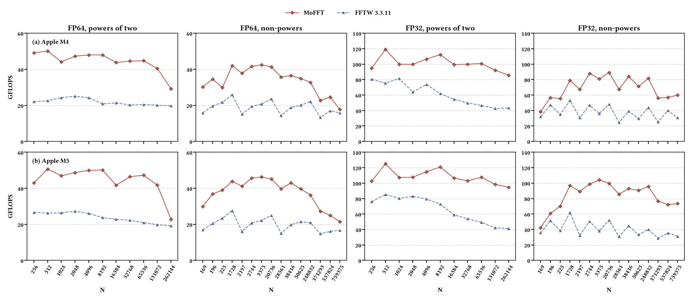

# MoFFT

[](https://github.com/ruge-zhang/MoFFT/actions/workflows/ci.yml)
[](LICENSE)

MoFFT is a matrix-oriented complex FFT library and kernel compiler for Arm SME
CPUs. It supports FP32 and FP64 C2C transforms, forward and backward
directions, and in-place and out-of-place execution. MoFFT builds on the
outer-product FFT approach introduced in
[OpenFFT-SME](https://doi.org/10.1109/IPDPS57955.2024.00088).

The compiler enumerates equivalent butterfly expressions, represents them with
a typed target-independent DAG, ranks them with a target profile, schedules the
selected operations, and lowers them to Arm SME/SME2 ACLE intrinsics. The
runtime combines the generated radix kernels into complete FFT plans.

## Overall performance on Apple M4 and M5



The commands below reproduce the build and measurement workflow. They target
an Apple arm64 machine with SME support and Apple Clang 21.0.0. Check the
toolchain before starting:

```sh
xcrun clang --version
cmake --version
python3 --version
```

### 1. Build FFTW 3.3.11 and a bootstrap profile

```sh
tools/build_fftw_3_3_11.sh

cmake -S . -B build/bootstrap -DCMAKE_BUILD_TYPE=Release \
  -DMOFFT_BUILD_TESTS=ON -DMOFFT_BUILD_TOOLS=ON
cmake --build build/bootstrap --target mofft_microbench \
  -j"$(sysctl -n hw.ncpu)"

build/bootstrap/mofft_microbench --iterations 50000 --samples 5 \
  > build/m5-microbench.json
PYTHONPATH=compiler python3 -m mofft_compiler.calibrate \
  build/m5-microbench.json --name apple-m5 \
  --output build/apple-m5-profile.json
```

The microbenchmark output and calibrated profile are machine-specific. Keep
them outside version control when reproducing a different device.

### 2. Validate candidates and build kernel wisdom

The candidate validator checks generated kernels numerically. Its optional
benchmark pass emits the three-pass measurements consumed by
`compile_kernel_wisdom.py`:

```sh
cmake -S . -B build/m5-kernels -DCMAKE_BUILD_TYPE=Release \
  -DMOFFT_PROFILE="$PWD/build/apple-m5-profile.json"
cmake --build build/m5-kernels --target mofft_validate_candidates \
  -j"$(sysctl -n hw.ncpu)"

PYTHONPATH=compiler python3 -m mofft_compiler.validate \
  --root . --profile "$PWD/build/apple-m5-profile.json" --benchmark \
  --benchmark-batches 512 --benchmark-repeats 32 \
  | tee build/m5-kernel-measurements.log

PYTHONPATH=compiler python3 tools/compile_kernel_wisdom.py \
  --profile build/apple-m5-profile.json \
  --machine "$(sysctl -n hw.model)" \
  --measurement 512:build/m5-kernel-measurements.log \
  --output build/m5-kernel-wisdom.json
```

The profile, compiler digest, and measurement machine must remain matched when
the kernel wisdom is used for code generation.

### 3. Search plans, compile wisdom, and run the M5 benchmark

Plan search uses the generated kernels and target profile. The size list can
be replaced by the sizes of interest; the list below is the extended suite
used by the benchmark executable.

```sh
cmake -S . -B build/m5-search -DCMAKE_BUILD_TYPE=Release \
  -DMOFFT_PROFILE="$PWD/build/apple-m5-profile.json" \
  -DMOFFT_KERNEL_WISDOM="$PWD/build/m5-kernel-wisdom.json"
cmake --build build/m5-search --target mofft_plan_search \
  -j"$(sysctl -n hw.ncpu)"

SIZES=256,512,1024,2048,4096,8192,16384,32768,65536,131072,262144,169,196,225,1728,2197,2744,3375,20736,28561,38416,50625,248832,371293,537824,759375
build/m5-search/mofft_plan_search \
  --sizes "$SIZES" --precision both --formal --exclusive-confirmed \
  --output build/m5-plan-wisdom.json

cmake -S . -B build-m5-overall -DCMAKE_BUILD_TYPE=Release \
  -DMOFFT_WITH_FFTW=ON \
  -DCMAKE_PREFIX_PATH="$PWD/build/deps/fftw-3.3.11/install" \
  -DMOFFT_PROFILE="$PWD/build/apple-m5-profile.json" \
  -DMOFFT_KERNEL_WISDOM="$PWD/build/m5-kernel-wisdom.json" \
  -DMOFFT_WISDOM="$PWD/build/m5-plan-wisdom.json"
cmake --build build-m5-overall -j --target mofft_benchmark
ctest --test-dir build-m5-overall --output-on-failure
build-m5-overall/mofft_benchmark --formal --exclusive-confirmed \
  --batches 30 --output build-m5-overall/m5-overall.json
```

`--formal --exclusive-confirmed` asserts that the run is in an exclusive,
powered, thermally stable measurement window. Omit those flags for a smoke
run.

### 4. Reproduce the M4 overall benchmark

The M4 workflow measures the device parameters first, then cross-compiles the
kernels, searches plans on the device, bakes the returned wisdom on the host,
and finally runs correctness and performance as separate steps. The commands
below use placeholders for all device, signing, and bundle identifiers:

```sh
: "${DEV:?set DEV to your paired-device identifier}"
: "${TEAM:?set TEAM to your Apple development team}"
: "${BENCH_BID:?set BENCH_BID to your benchmark bundle identifier}"
: "${CAL_BID:?set CAL_BID to your calibration bundle identifier}"
: "${SEARCH_BID:?set SEARCH_BID to your plan-search bundle identifier}"
mkdir -p build

# A bootstrap library supplies the manifest needed to build the calibration app.
cmake -S . -B build-m4-bootstrap -DCMAKE_SYSTEM_NAME=iOS \
  -DCMAKE_OSX_SYSROOT=iphoneos -DCMAKE_OSX_ARCHITECTURES=arm64 \
  -DCMAKE_OSX_DEPLOYMENT_TARGET=16.0 \
  -DMOFFT_BUILD_TESTS=OFF -DMOFFT_BUILD_TOOLS=OFF
cmake --build build-m4-bootstrap --target mofft \
  -j"$(sysctl -n hw.ncpu)"

cmake -S ios-app -B ios-app/build-m4-tools -G Xcode \
  -DMOFFT_LIBRARY_BUILD="$PWD/build-m4-bootstrap" \
  -DMOFFT_FFTW_IOS_PREFIX="$PWD/build/deps/fftw-3.3.11/install-ios" \
  -DMOFFT_IOS_BUNDLE_IDENTIFIER="$BENCH_BID" \
  -DMOFFT_IOS_CALIBRATE_BUNDLE_IDENTIFIER="$CAL_BID" \
  -DMOFFT_IOS_SEARCH_BUNDLE_IDENTIFIER="$SEARCH_BID"
xcodebuild -project ios-app/build-m4-tools/mofftbench_ios.xcodeproj \
  -target mofftcalibrate -sdk iphoneos -configuration Release build \
  DEVELOPMENT_TEAM="$TEAM" CODE_SIGN_STYLE=Automatic \
  -allowProvisioningUpdates
CAL_APP="$(find ios-app/build-m4-tools -type d -name mofftcalibrate.app -print -quit)"
xcrun devicectl device install app --device "$DEV" "$CAL_APP"
xcrun devicectl device process launch --device "$DEV" --console \
  --terminate-existing -- "$CAL_BID" --iterations 200000 --samples 9 \
  > build-m4-calibration-console.log
python3 tools/extract_device_json.py build-m4-calibration-console.log \
  --output build/m4-microbench.json
PYTHONPATH=compiler python3 -m mofft_compiler.calibrate \
  build/m4-microbench.json --name apple-m4 \
  --output build/apple-m4-profile.json
```

Cross-compile the kernels with the measured profile, then build the device
plan-search target. Each launch below is a controlled shard. The plan-search
program prints a wisdom object between `WISDOM_JSON_BEGIN` and
`WISDOM_JSON_END`, so no sandbox file is needed:

```sh
cmake -S . -B build-m4-kernels -DCMAKE_SYSTEM_NAME=iOS \
  -DCMAKE_OSX_SYSROOT=iphoneos -DCMAKE_OSX_ARCHITECTURES=arm64 \
  -DCMAKE_OSX_DEPLOYMENT_TARGET=16.0 \
  -DMOFFT_BUILD_TESTS=OFF -DMOFFT_BUILD_TOOLS=OFF \
  -DMOFFT_PROFILE="$PWD/build/apple-m4-profile.json"
cmake --build build-m4-kernels --target mofft \
  -j"$(sysctl -n hw.ncpu)"

cmake -S ios-app -B ios-app/build-m4-search -G Xcode \
  -DMOFFT_LIBRARY_BUILD="$PWD/build-m4-kernels" \
  -DMOFFT_FFTW_IOS_PREFIX="$PWD/build/deps/fftw-3.3.11/install-ios" \
  -DMOFFT_IOS_BUNDLE_IDENTIFIER="$BENCH_BID" \
  -DMOFFT_IOS_CALIBRATE_BUNDLE_IDENTIFIER="$CAL_BID" \
  -DMOFFT_IOS_SEARCH_BUNDLE_IDENTIFIER="$SEARCH_BID"
xcodebuild -project ios-app/build-m4-search/mofftbench_ios.xcodeproj \
  -target mofftsearch -sdk iphoneos -configuration Release build \
  DEVELOPMENT_TEAM="$TEAM" CODE_SIGN_STYLE=Automatic \
  -allowProvisioningUpdates
SEARCH_APP="$(find ios-app/build-m4-search -type d -name mofftsearch.app -print -quit)"
xcrun devicectl device install app --device "$DEV" "$SEARCH_APP"

mkdir -p build/m4-plan-shards
for precision in fp32 fp64; do
  for n in 256 512 1024 2048 4096 8192 16384 32768 65536 131072 262144 \
           169 196 225 1728 2197 2744 3375 20736 28561 38416 50625 \
           248832 371293 537824 759375; do
    xcrun devicectl device process launch --device "$DEV" --console \
      --terminate-existing -- "$SEARCH_BID" --sizes "$n" \
      --precision "$precision" --candidates 32 --samples 7 \
      --steady-finalists 4 --steady-warmup 1000 \
      > "build/m4-plan-shards/${precision}-${n}.log"
  done
done
python3 tools/merge_plan_wisdom.py build/m4-plan-shards/*.log \
  --output build/m4-plan-wisdom.json
```

Bake the merged device wisdom into the final iOS library. Set `M4_MACHINE` to
the machine string recorded in the plan-search JSON before running this step:

```sh
M4_MACHINE=<target-machine-recorded-in-build-m4-plan-wisdom.json>
cmake -S . -B build-m4-final -DCMAKE_SYSTEM_NAME=iOS \
  -DCMAKE_OSX_SYSROOT=iphoneos -DCMAKE_OSX_ARCHITECTURES=arm64 \
  -DCMAKE_OSX_DEPLOYMENT_TARGET=16.0 \
  -DMOFFT_BUILD_TESTS=OFF -DMOFFT_BUILD_TOOLS=OFF \
  -DMOFFT_PROFILE="$PWD/build/apple-m4-profile.json" \
  -DMOFFT_WISDOM="$PWD/build/m4-plan-wisdom.json" \
  -DMOFFT_WISDOM_MACHINE="$M4_MACHINE"
cmake --build build-m4-final --target mofft -j"$(sysctl -n hw.ncpu)"

cmake -S ios-app -B ios-app/build-m4-final -G Xcode \
  -DMOFFT_LIBRARY_BUILD="$PWD/build-m4-final" \
  -DMOFFT_FFTW_IOS_PREFIX="$PWD/build/deps/fftw-3.3.11/install-ios" \
  -DMOFFT_IOS_BUNDLE_IDENTIFIER="$BENCH_BID" \
  -DMOFFT_IOS_CALIBRATE_BUNDLE_IDENTIFIER="$CAL_BID" \
  -DMOFFT_IOS_SEARCH_BUNDLE_IDENTIFIER="$SEARCH_BID"
xcodebuild -project ios-app/build-m4-final/mofftbench_ios.xcodeproj \
  -target mofftbench -sdk iphoneos -configuration Release build \
  DEVELOPMENT_TEAM="$TEAM" CODE_SIGN_STYLE=Automatic \
  -allowProvisioningUpdates
BENCH_APP="$(find ios-app/build-m4-final -type d -name mofftbench.app -print -quit)"
xcrun devicectl device install app --device "$DEV" "$BENCH_APP"
```

Run the overall-size correctness check before timing. The public suite excludes
`N=144`. The performance pass is intentionally a controlled shard run rather
than a formal run because the large sizes use different batch counts:

```sh
xcrun devicectl device process launch --device "$DEV" --console \
  --terminate-existing -- "$BENCH_BID" --correctness --precision both

SMALL_SIZES=256,512,1024,2048,4096,8192,16384,32768,65536,131072,262144,169,196,225,1728,2197,2744,3375,20736,28561,38416,50625
xcrun devicectl device process launch --device "$DEV" --console \
  --terminate-existing -- "$BENCH_BID" --sizes "$SMALL_SIZES" \
  --batches 15 > build-m4-overall-small.log
xcrun devicectl device process launch --device "$DEV" --console \
  --terminate-existing -- "$BENCH_BID" --sizes 248832 --batches 7 \
  > build-m4-overall-248832.log
xcrun devicectl device process launch --device "$DEV" --console \
  --terminate-existing -- "$BENCH_BID" \
  --sizes 371293,537824,759375 --batches 1 \
  > build-m4-overall-large.log
cat build-m4-overall-small.log build-m4-overall-248832.log \
  build-m4-overall-large.log > build-m4-overall.log
```

Keep device identifiers, signing identities, raw measurements, and
target-specific wisdom outside the public repository. The captured log can be
plotted together with the M5 JSON using the command below.

### 5. Plot the public benchmark output

The public plotter accepts the JSON output from the host benchmark or the
captured iOS log. Pass both files to obtain one M4/M5 comparison figure:

```sh
python3 benchmarks/plot_results.py \
  --results build-m4-overall.log --label "Apple M4" \
  --results build-m5-overall/m5-overall.json --label "Apple M5" \
  --layout overall \
  --output build/overall-m4-m5.png
```

## Build and test

```sh
python3 -m venv .venv
. .venv/bin/activate
python -m pip install -e .
cmake -S . -B build -DCMAKE_BUILD_TYPE=Release
cmake --build build -j
ctest --test-dir build --output-on-failure
cmake --build build --target mofft_validate_candidates
cmake --build build --target mofft_check_codegen
```

Generated C files are placed under `build/generated` and are not checked into
the source tree. FFTW is optional for normal builds and is enabled with
`-DMOFFT_WITH_FFTW=ON`. FFTW is obtained separately under its own license.
Anyone redistributing an FFTW-linked binary must comply with the applicable
FFTW license terms.

## Source provenance

The microbenchmark methodology is informed by the MIT-licensed
`m4-sme-exploration` project and the public `scalable-analyses/sme` artifacts:

- https://github.com/tzakharko/m4-sme-exploration
- https://github.com/scalable-analyses/sme

## Contributing and license

MoFFT is licensed under [Apache-2.0](LICENSE). See
[CONTRIBUTING.md](CONTRIBUTING.md), [SECURITY.md](SECURITY.md), and
[CITATION.cff](CITATION.cff).
